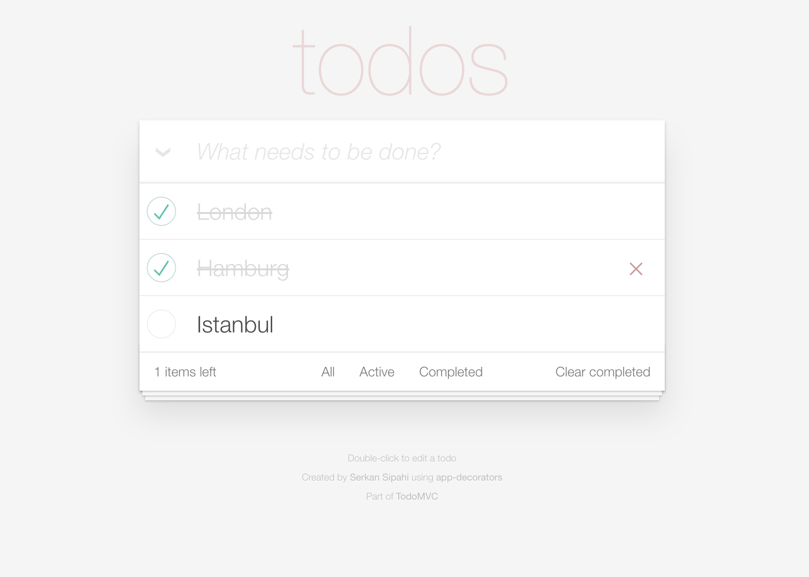

---
# app-decorators-todomvc

<p>
    <a href="https://david-dm.org/SerkanSipahi/app-decorators-todomvc"></a>
    <a href="https://david-dm.org/SerkanSipahi/app-decorators-todomvc/?type=dev"></a>
</p>
---
<p align="center">
  
</p>
---
```bash
git clone https://github.com/SerkanSipahi/app-decorators-todomvc.git
cd app-decorators-todomvc
make install
make start
```

open following url `http://localhost:3000/` in your browser.